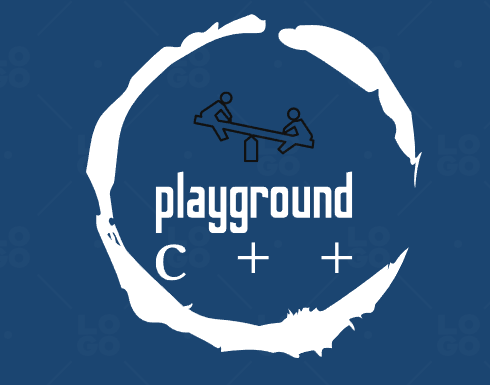

<h1 align="center">Playground</h1>
<h2>What is it about?</h2>

Team playground is aiming to make a game, the idea of which was conceived by the original 2048, made in 2014 by Gabriele Cirull, who at the time, was trying to program a game from scratch.
<h2>Technologies used for this project</h2>
  
   
<h2>Collaborators</h2>
<ul>
<li>Martin Belchev - Backend Developer</li>
<li>Ivo Badalov - Frontend Developer</li>
<li>Stelian Nikolov - QA </li>
</ul>